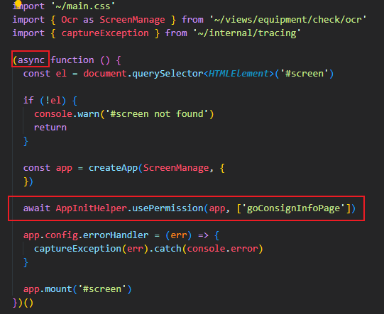

# 权限添加操作指南
1. ``entrypoints``文件夹下的入口文件内，使用``AppInitHelper.usePermission()``方法。
> 
> * 注*：请在app挂载前将实例传入``usePermission``方法，否则可能导致指令工作异常。
2. 在具体页面使用v-permission指令，如 ``<a-button v-permission="'admin'">添加</a-button>``
