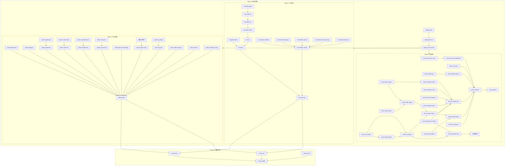

# 任务：基于产品文档生成功能级 Specs 开发计划（全端拆分）

## 输入文档（AI 必须先读取再规划）

1. `mydocs/full-feature-list.md` — 产品功能清单 v4.0（唯一产品真相源）
2. `mydocs/feature-task-mapping.md` — 功能→任务四维映射
3. `mydocs/api-contracts.md` — API 接口契约
4. `mydocs/db-schema.md` — 数据库 Schema
5. `mydocs/member-system-design.md` — 会员体系设计
6. `mydocs/frontend-routes.md` — 前端路由结构
7. `mydocs/frontend-wireframes.md` — 前端线框图描述
8. `mydocs/decoupling-design.md` — 解耦设计

## 核心原则

### 拆分粒度规则

- **每个 Spec = 一个独立可交付的功能点或页面**
- **spec.md ≤ 150 行**，tasks.md ≤ 80 行，tests.md ≤ 100 行，checklist.md ≤ 50 行
- AI 执行时只加载：`_index.md` (~120行) + 当前 spec 四件套 (~380行) = ~500行
- **禁止将多个页面合并到一个 spec 中**

### 一期/二期区分

- 一期 = full-feature-list.md 中 🟢 标记的功能
- 二期 = 🔵 标记的功能
- `_index.md` 中用阶段列明确标注，二期 spec 标注 `[🔵 二期]`

### 测试分级规则

按**业务逻辑密度**分三级，不同级别对应不同的测试深度和覆盖率要求：

| 级别 | 覆盖范围 | 测试深度 | 覆盖率要求 | 占比 |
|:---|:---|:---|:---|:---|
| **L1 深度测试** | 服务端 Service 层 + 前端核心 Composable/Store | 单元测试全覆盖 + 边界场景 + 异常场景 | ≥90% | ~20 个 spec |
| **L2 标准测试** | 前端有逻辑的页面（表单校验、状态流转） | 关键路径 + 表单校验 + 状态流转 | ≥70% | ~25 个 spec |
| **L3 轻量测试** | 纯展示页面 + 基础设施 | 冒烟测试 + 集成验证 | 无要求 | ~26 个 spec |

**各端测试重点**：

| 端 | 测试重点 | 不测 |
|:---|:---|:---|
| 服务端 | Service 层业务逻辑全覆盖（折扣/等级/积分/金额/余额/幂等性） | Controller 层（仅测入参校验和错误码） |
| H5 前端 | Composable + Store + Utils 全覆盖；仅复杂组件测试 | 纯展示页面（由 E2E 覆盖） |
| 后台前端 | 表单校验 + 权限逻辑 + 报表计算 | Ant Design Vue 组件自身 |

---

## 输出文件结构

```
.trae/specs/
├── _index.md                          ← 总控索引（唯一入口）
│
├── phase0-infra/                      ← Phase 0: 基础设施 [🟢 一期]
│   ├── infra-scaffold/
│   │   ├── spec.md
│   │   ├── tasks.md
│   │   ├── tests.md                   ← L3 轻量测试
│   │   └── checklist.md
│   ├── infra-theme/
│   ├── infra-mock/
│   └── infra-shared/
│
├── h5-auth-login/                     ← Phase 1-H5 [🟢 一期]
│   ├── spec.md
│   ├── tasks.md
│   ├── tests.md                       ← L2 标准测试
│   └── checklist.md
├── h5-home/                           ← L3
├── h5-goods-detail/                   ← L3
├── h5-cart/                           ← L1 深度测试（购物车计算核心）
├── h5-order-confirm/                  ← L1 深度测试（订单金额计算核心）
├── h5-order-pay/                      ← L1 深度测试（支付状态机核心）
├── h5-order-list/                     ← L3
├── h5-order-detail/                   ← L3
├── h5-member-center/                  ← L3
├── h5-member-benefits/                ← L3
├── h5-member-recharge/                ← L2
├── h5-member-points/                  ← L3
├── h5-member-recharge-logs/           ← L3
├── h5-member-balance/                 ← L3
├── h5-table-qrcode/                   ← L3
├── h5-new-user-guide/                 ← L3
│
├── admin-login/                       ← Phase 2-Admin [🟢 一期] L2
├── admin-dashboard/                   ← L3
├── admin-category/                    ← L2
├── admin-goods-list/                  ← L3
├── admin-goods-edit/                  ← L2
├── admin-order-list/                  ← L3
├── admin-order-detail/                ← L2
├── admin-member-list/                 ← L3
├── admin-member-detail/               ← L2
├── admin-account-list/                ← L2
├── admin-role-perm/                   ← L2
├── admin-personal-settings/           ← L3
├── admin-report-sales/                ← L3
├── admin-report-goods-ranking/        ← L3
├── admin-report-member-stats/         ← L3
├── admin-report-hourly/               ← L3
├── admin-log-list/                    ← L3
├── admin-log-detail/                  ← L3
├── admin-table-manage/                ← L2
├── admin-banner/                      ← L2
├── admin-member-config/               ← L2
│
├── server-db-init/                    ← Phase 3-Server [🟢 一期] L3
├── server-auth-wx/                    ← L1
├── server-auth-phone/                 ← L1
├── server-goods-query/                ← L1
├── server-goods-admin/                ← L1
├── server-order-create/               ← L1（订单金额计算核心）
├── server-order-pay/                  ← L1（支付状态机核心）
├── server-order-refund/               ← L1（退款金额计算核心）
├── server-order-query/                ← L1
├── server-order-admin/                ← L1
├── server-member-info/                ← L1（等级/折扣计算核心）
├── server-member-recharge/            ← L1（充值/升级核心）
├── server-member-points/              ← L1（积分计算核心）
├── server-member-balance/             ← L1（余额事务核心）
├── server-member-code/                ← L1
├── server-member-admin/               ← L1
├── server-payment-sqb/                ← L1（收钱吧签名/验签核心）
├── server-admin-goods/                ← L1
├── server-admin-orders/               ← L1
├── server-admin-members/              ← L1
├── server-admin-system/               ← L1
├── server-admin-report/               ← L1
├── server-admin-log/                  ← L1
├── server-cron-tasks/                 ← L1
├── server-wx-jsapi/                   ← L1
├── server-security-middleware/        ← L1
├── server-cloud-func-arch/            ← L2
│
├── deploy-mock-switch/               ← Phase 4 L2
├── deploy-e2e-test/                   ← L1（E2E 关键路径）
└── deploy-prod/                       ← L3
│
└── [🔵 二期 specs 占位]
    ├── h5-community-feed/
    ├── h5-community-post/
    ├── h5-community-detail/
    ├── h5-cashier/
    ├── admin-community/
    └── server-community/
```

---

## _index.md 完整模板

```markdown
# 开发计划总控索引 v4.0

> 本文件是整个开发计划的唯一入口和调度中心。
> AI 执行前必须先读此文件确定当前任务。

## 全局约束（所有 spec 共享）

### 技术栈
| 端 | 技术栈 |
|:---|:---|
| H5前端 | uni-app Vue3 (Composition API) + Vant UI 4 + Pinia + TypeScript |
| 后台前端 | Vue3 + Vben Admin + Ant Design Vue + ECharts + TypeScript |
| 服务端 | uniCloud Node.js (阿里云) + MongoDB + 自定义JWT |
| 测试 | Vitest + Vue Test Utils + Playwright(E2E) |

### 全局规范
- 金额单位：分（整数），前端展示时 /100 保留两位小数
- 时间格式：ISO 8601（服务端），展示格式化后（前端）
- 主题色：#4ECDC4，所有色值引用 CSS Variables，禁止硬编码
- 认证方式：自定义 JWT（httpOnly Cookie），前端 withCredentials: true
- Token 有效期：access_token 7天，refresh_token 30天
- 密码加密：bcrypt (cost=12) 或 argon2id，禁止 MD5/SHA1
- 接口版本前缀：/api/v1/
- 错误码：统一错误码体系（见 api-contracts.md §全局约定）

### 测试规范
- 测试框架：Vitest（单元/集成）+ Playwright（E2E）
- 测试文件位置：与源文件同目录，`__tests__` 文件夹或 `.spec.ts` 后缀
- 测试分级：L1(深度) / L2(标准) / L3(轻量)，每个 spec 的 tests.md 中声明级别
- 覆盖率要求：L1 ≥90%, L2 ≥70%, L3 无要求
- Mock 策略：
  - Service 测试 Mock Repository 层
  - Repository 测试使用内存 MongoDB（mongodb-memory-server）
  - 前端测试 Mock api client + vue-router + wx 对象
  - API 测试 Mock 外部依赖（微信API/收钱吧API）
- CI 集成：每个 spec 完成后必须 `vitest run` 通过

### 一期边界
full-feature-list.md v4.0 中 🟢 标记的所有功能。
🔵 二期标记的功能不在本次开发范围内，但需预留接口扩展能力。

## 基准文档映射（所有 spec 共享）

| 文档 | 路径 | 提供内容 |
|:---|:---|:---|
| 产品功能清单 | mydocs/full-feature-list.md | 功能定义的唯一真相源 |
| API 接口契约 | mydocs/api-contracts.md | 接口 Req/Res 结构、错误码、全局约定 |
| 数据库 Schema | mydocs/db-schema.md | 集合定义、字段、索引、关系 |
| 会员体系设计 | mydocs/member-system-design.md | 等级表、折扣规则、积分规则、充值档位 |
| 前端路由 | mydocs/frontend-routes.md | 页面路径与参数 |
| 前端线框图 | mydocs/frontend-wireframes.md | UI 布局参考 |
| 解耦设计 | mydocs/decoupling-design.md | 架构分层、前后端分离策略 |

## 前置准备清单

### 1. 基础设施
| # | 准备项 | 负责人 | 截止日期 | 阻塞 Phase | 验证方式 | 状态 |
|:---|:---|:---|:---|:---|:---|:---|
| 1.1 | uniCloud 阿里云服务空间创建 | | | P0,P3 | 控制台可访问 | ⬜ |
| 1.2 | uniCloud 云函数 URL 化配置 | | | P3,P4 | HTTP 可调用 | ⬜ |
| 1.3 | uniCloud 前端托管配置 | | | P4 | 自定义域名可访问 | ⬜ |
| 1.4 | MongoDB 集合初始化脚本就绪 | | | P3 | 脚本可执行 | ⬜ |

### 2. 域名与网络
| # | 准备项 | 负责人 | 截止日期 | 阻塞 Phase | 验证方式 | 状态 |
|:---|:---|:---|:---|:---|:---|:---|
| 2.1 | 主域名注册与备案 | | | P4 | ICP 备案号获取 | ⬜ |
| 2.2 | DNS 解析配置（order/admin/api 子域） | | | P4 | dig/ping 通 | ⬜ |
| 2.3 | HTTPS 证书申请与部署 | | | P4 | 浏览器绿锁 | ⬜ |
| 2.4 | Nginx 反向代理配置 | | | P4 | /admin/* 路由正确 | ⬜ |

### 3. 微信生态
| # | 准备项 | 负责人 | 截止日期 | 阻塞 Phase | 验证方式 | 状态 |
|:---|:---|:---|:---|:---|:---|:---|
| 3.1 | 公众号注册（服务号类型） | | | P1(h5-auth) | AppID 获取 | ⬜ |
| 3.2 | 授权回调域名配置 | | | P1(h5-auth) | 授权跳转正常 | ⬜ |
| 3.3 | JS 安全域名配置 | | | P1(h5-pay) | wx.config 成功 | ⬜ |
| 3.4 | IP 白名单配置 | | | P3(server-auth) | 服务端可调微信API | ⬜ |
| 3.5 | 微信支付商户号（如需直连） | | | P3(server-pay) | 商户号获取 | ⬜ |

### 4. 支付通道
| # | 准备项 | 负责人 | 截止日期 | 阻塞 Phase | 验证方式 | 状态 |
|:---|:---|:---|:---|:---|:---|:---|
| 4.1 | 收钱吧商户入驻 | | | P3(sqb-integration) | 商户号+密钥获取 | ⬜ |
| 4.2 | 收钱吧沙箱测试账号 | | | P3(sqb-integration) | 沙箱下单成功 | ⬜ |
| 4.3 | 收钱吧回调 URL 配置 | | | P4 | 回调可达 | ⬜ |

### 5. 开发环境
| # | 准备项 | 负责人 | 截止日期 | 阻塞 Phase | 验证方式 | 状态 |
|:---|:---|:---|:---|:---|:---|:---|
| 5.1 | Node.js ≥18 安装 | | | P0 | node -v | ⬜ |
| 5.2 | pnpm ≥8 安装 | | | P0 | pnpm -v | ⬜ |
| 5.3 | 微信开发者工具安装 | | | P1 | 工具可启动 | ⬜ |
| 5.4 | Git 仓库初始化 + 分支策略 | | | P0 | main/dev 存在 | ⬜ |

### 6. 设计资源
| # | 准备项 | 负责人 | 截止日期 | 阻塞 Phase | 验证方式 | 状态 |
|:---|:---|:---|:---|:---|:---|:---|
| 6.1 | UI 设计稿确认（Figma/蓝湖链接） | | | P1,P2 | 链接可用 | ⬜ |
| 6.2 | 品牌素材（Logo/启动图/空状态插图） | | | P1(auth) | 素材文件存在 | ⬜ |
| 6.3 | 首批商品图片（≥10个SKU） | | | P1(home) | 图片可访问 | ⬜ |

---

## Spec 索引与执行顺序

### Phase 0: 基础设施 [🟢 一期]

> 无外部依赖，可在任意时间启动。内部子任务串行。

| 序号 | Spec ID | 名称 | 功能点 ID 范围 | 测试级别 | 状态 | 依赖 | 预计工期 |
|:---|:---|:---|:---|:---|:---|:---|:---|
| 0.1 | infra-scaffold | 工程骨架搭建 | — | L3 | ⬜ | 无 | 1天 |
| 0.2 | infra-theme | 设计规范落地 | H5-THEME-001~002 | L3 | ⬜ | 0.1 | 1天 |
| 0.3 | infra-mock | Mock 服务搭建 | — | L2 | ⬜ | 0.1 | 0.5天 |
| 0.4 | infra-shared | 共享包初始化 | — | L2 | ⬜ | 0.1 | 0.5天 |

### Phase 1: H5 前端开发 [🟢 一期]

> 基于 Mock 数据开发。Phase 0 完成后启动。

| 序号 | Spec ID | 名称 | 功能点 ID 范围 | 测试级别 | 状态 | 依赖 | 预计工期 |
|:---|:---|:---|:---|:---|:---|:---|:---|
| 1.1 | h5-auth-login | 微信授权登录 | H5-AUTH-001~005, H5-AUTH-001B | L2 | ⬜ | 0.2, 0.3 | 1.5天 |
| 1.2 | h5-home | 首页 | H5-HOME-001~008, H5-TABLE-001~002 | L3 | ⬜ | 1.1 | 2天 |
| 1.3 | h5-goods-detail | 商品详情 | （首页内嵌，无独立ID） | L3 | ⬜ | 1.2 | 1天 |
| 1.4 | h5-cart | 购物车 | H5-CART-001~005 | **L1** | ⬜ | 1.2 | 1.5天 |
| 1.5 | h5-order-confirm | 订单确认 | H5-ORDER-CONFIRM-001~007 | **L1** | ⬜ | 1.4 | 1.5天 |
| 1.6 | h5-order-pay | 订单支付 | H5-PAY-001~009 | **L1** | ⬜ | 1.5 | 1.5天 |
| 1.7 | h5-order-list | 订单列表 | H5-ORDER-LIST-001~007 | L3 | ⬜ | 1.6 | 1.5天 |
| 1.8 | h5-order-detail | 订单详情 | （订单列表内嵌） | L3 | ⬜ | 1.7 | 1天 |
| 1.9 | h5-member-center | 会员中心 | H5-MEMBER-000~008 | L3 | ⬜ | 1.1 | 1.5天 |
| 1.10 | h5-member-benefits | 会员权益 | H5-BENEFIT-001~004 | L3 | ⬜ | 1.9 | 1天 |
| 1.11 | h5-member-recharge | 会员充值 | H5-RECHARGE-001~004 | L2 | ⬜ | 1.9 | 1.5天 |
| 1.12 | h5-member-points | 积分明细 | H5-POINT-001~003 | L3 | ⬜ | 1.9 | 1天 |
| 1.13 | h5-member-recharge-logs | 充值记录 | H5-RECHARGE-LOG-001 | L3 | ⬜ | 1.9 | 0.5天 |
| 1.14 | h5-member-balance | 余额明细 | H5-BALANCE-001~003 | L3 | ⬜ | 1.9 | 0.5天 |
| 1.15 | h5-table-qrcode | 桌台码扫码 | H5-TABLE-001~002 | L3 | ⬜ | 1.2 | 0.5天 |
| 1.16 | h5-new-user-guide | 新用户引导 | H5-HOME-008 | L3 | ⬜ | 1.1 | 0.5天 |

**并行组 A**: {1.2, 1.9} 可并行（首页 & 会员中心无依赖关系）
**并行组 B**: {1.3, 1.4} 可并行（商品详情 & 购物车）
**串行链路**: 1.4 → 1.5 → 1.6 → 1.7 → 1.8（交易核心链路）

### Phase 2: 后台管理前端开发 [🟢 一期]

> 基于 Mock 数据开发。可与 Phase 1 并行。

| 序号 | Spec ID | 名称 | 功能点 ID 范围 | 测试级别 | 状态 | 依赖 | 预计工期 |
|:---|:---|:---|:---|:---|:---|:---|:---|
| 2.1 | admin-login | 后台登录页 | ADM-LOGIN-001 | L2 | ⬜ | 0.2, 0.3 | 0.5天 |
| 2.2 | admin-dashboard | 数据概览Dashboard | ADM-DASH-001~004 | L3 | ⬜ | 2.1 | 1天 |
| 2.3 | admin-category | 分类管理 | ADM-CATE-001~002 | L2 | ⬜ | 2.1 | 0.5天 |
| 2.4 | admin-goods-list | 商品列表 | ADM-GOODS-001 | L3 | ⬜ | 2.1 | 1天 |
| 2.5 | admin-goods-edit | 商品编辑 | ADM-GOODS-002 | L2 | ⬜ | 2.4 | 1.5天 |
| 2.6 | admin-order-list | 订单列表 | ADM-ORDER-001 | L3 | ⬜ | 2.1 | 1天 |
| 2.7 | admin-order-detail | 订单详情+退款 | ADM-ORDER-002~003 | L2 | ⬜ | 2.6 | 1.5天 |
| 2.8 | admin-member-list | 会员列表 | ADM-MEMBER-001 | L3 | ⬜ | 2.1 | 1天 |
| 2.9 | admin-member-detail | 会员详情+调整 | ADM-MEMBER-002 | L2 | ⬜ | 2.8 | 1天 |
| 2.10 | admin-account-list | 账号管理 | ADM-SYS-001 | L2 | ⬜ | 2.1 | 0.5天 |
| 2.11 | admin-role-perm | 角色权限配置 | ADM-SYS-002 | L2 | ⬜ | 2.10 | 0.5天 |
| 2.12 | admin-personal-settings | 个人设置 | ADM-SYS-003 | L3 | ⬜ | 2.1 | 0.5天 |
| 2.13 | admin-report-sales | 营业报表 | ADM-REPORT-001 | L3 | ⬜ | 2.1 | 1天 |
| 2.14 | admin-report-goods-ranking | 商品销售排行 | ADM-REPORT-002 | L3 | ⬜ | 2.13 | 0.5天 |
| 2.15 | admin-report-member-stats | 会员统计 | ADM-REPORT-003 | L3 | ⬜ | 2.13 | 0.5天 |
| 2.16 | admin-report-hourly | 时段分析 | ADM-REPORT-004 | L3 | ⬜ | 2.13 | 0.5天 |
| 2.17 | admin-log-list | 操作日志列表 | ADM-LOG-001 | L3 | ⬜ | 2.1 | 0.5天 |
| 2.18 | admin-log-detail | 操作日志详情 | ADM-LOG-002 | L3 | ⬜ | 2.17 | 0.5天 |
| 2.19 | admin-table-manage | 桌号管理 | ADM-TABLE-001~002 | L2 | ⬜ | 2.1 | 0.5天 |
| 2.20 | admin-banner | Banner 管理 | ADM-BANNER-001 | L2 | ⬜ | 2.1 | 0.5天 |
| 2.21 | admin-member-config | 会员配置 | ADM-CONFIG-001 | L2 | ⬜ | 2.1 | 0.5天 |

**并行组**: {2.3, 2.4, 2.6, 2.8, 2.10, 2.13, 2.17, 2.19, 2.20, 2.21} 可全部并行（仅依赖 2.1）

### Phase 3: 服务端 API 开发 [🟢 一期]

> Phase 1+2 的关键路径完成后启动。

| 序号 | Spec ID | 名称 | 对应 API | 测试级别 | 状态 | 依赖 | 预计工期 |
|:---|:---|:---|:---|:---|:---|:---|:---|
| 3.1 | server-db-init | 数据库初始化 | — | L3 | ⬜ | 0.1 | 1天 |
| 3.2 | server-auth-wx | 微信认证 | wx-login, token-refresh, logout | **L1** | ⬜ | 3.1 | 1天 |
| 3.3 | server-auth-phone | 手机号认证 | phone-login | **L1** | ⬜ | 3.2 | 0.5天 |
| 3.4 | server-goods-query | 商品查询 | goods-list, goods-detail | **L1** | ⬜ | 3.2 | 1天 |
| 3.5 | server-goods-admin | 商品管理API | admin-goods-list, admin-goods-save | **L1** | ⬜ | 3.4 | 1天 |
| 3.6 | server-order-create | 订单创建 | order-create, order-preview | **L1** | ⬜ | 3.4, 3.11 | 1.5天 |
| 3.7 | server-order-pay | 支付处理 | order-pay-callback, order-query | **L1** | ⬜ | 3.6, 3.19 | 1.5天 |
| 3.8 | server-order-refund | 退款处理 | refund-request, refund-process | **L1** | ⬜ | 3.7 | 1天 |
| 3.9 | server-order-query | 订单查询(用户) | order-list, order-detail | **L1** | ⬜ | 3.6 | 1天 |
| 3.10 | server-order-admin | 订单管理API | admin-orders-list, admin-order-update | **L1** | ⬜ | 3.9 | 1天 |
| 3.11 | server-member-info | 会员信息 | member-info, member-benefits, member-code-decode | **L1** | ⬜ | 3.2 | 1天 |
| 3.12 | server-member-recharge | 充值模块 | member-recharge, member-recharge-callback, member-recharge-tiers | **L1** | ⬜ | 3.11, 3.19 | 1.5天 |
| 3.13 | server-member-points | 积分模块 | member-point-logs, member-point-calculate | **L1** | ⬜ | 3.11 | 1天 |
| 3.14 | server-member-balance | 余额模块 | member-balance-pay, member-balance-logs | **L1** | ⬜ | 3.11 | 0.5天 |
| 3.15 | server-member-code | 会员码 | member-code-decode | **L1** | ⬜ | 3.11 | 0.5天 |
| 3.16 | server-member-admin | 会员管理API | admin-members-list, admin-members-detail, admin-point-adjust | **L1** | ⬜ | 3.11 | 1天 |
| 3.17 | server-payment-sqb | 收钱吧集成 | sqb-precreate, sqb-refund, sqb-query | **L1** | ⬜ | 外部依赖(4.1) | 1.5天 |
| 3.18 | server-admin-goods | 后台商品API | (合并至 3.5) | **L1** | ⬜ | 3.5 | — |
| 3.19 | server-admin-orders | 后台订单API | (合并至 3.10) | **L1** | ⬜ | 3.10 | — |
| 3.20 | server-admin-members | 后台会员API | (合并至 3.16) | **L1** | ⬜ | 3.16 | — |
| 3.21 | server-admin-system | 后台系统API | admin-login, admin-config-* | **L1** | ⬜ | 3.2 | 1天 |
| 3.22 | server-admin-report | 后台报表API | admin-report-* | **L1** | ⬜ | 3.9, 3.16 | 1天 |
| 3.23 | server-admin-log | 后台日志API | admin-log-* | **L1** | ⬜ | 3.21 | 0.5天 |
| 3.24 | server-cron-tasks | 定时任务 | (积分过期/订单超时/日志归档) | **L1** | ⬜ | 3.7, 3.8 | 0.5天 |
| 3.25 | server-wx-jsapi | 微信JS-SDK签名 | wx-jsapi-signature | **L1** | ⬜ | 3.2 | 0.5天 |
| 3.26 | server-security-middleware | 安全中间件 | (限流/XSS/NoSQL注入/CSP头) | **L1** | ⬜ | 3.2 | 1天 |
| 3.27 | server-cloud-func-arch | 云函数合并架构 | (order/member/auth/admin 路由分发) | L2 | ⬜ | 3.26 | 0.5天 |

**并行组 A**: {3.4, 3.11} 并行（商品 & 会员查询）
**并行组 B**: {3.5, 3.9, 3.13, 3.14, 3.15, 3.25} 并行（基于 A 组结果）
**并行组 C**: {3.22, 3.23} 并行（报表 & 日志，依赖较晚）

### Phase 4: 联调与部署 [🟢 一期]

| 序号 | Spec ID | 名称 | 测试级别 | 状态 | 依赖 | 预计工期 |
|:---|:---|:---|:---|:---|:---|:---|
| 4.1 | deploy-mock-switch | Mock→真实API切换 | L2 | ⬜ | P1+P2+P3 完成 | 0.5天 |
| 4.2 | deploy-e2e-test | 端到端联调 | **L1** | ⬜ | 4.1 | 1天 |
| 4.3 | deploy-prod | 生产部署 | L3 | ⬜ | 4.2 + 前置准备完成 | 1天 |

### 二期占位 [🔵 二期]

以下 Spec 在二期开发，当前仅占位，不生成具体内容：

| Spec ID | 名称 | 功能点来源 |
|:---|:---|:---|
| h5-community-feed | 社区动态广场 | H5-COMMUNITY-001~004 |
| h5-community-post | 社区发帖 | H5-COM-POST-001 |
| h5-community-detail | 社区帖子详情 | H5-COM-DETAIL-001 |
| h5-cashier | 店员收银端 | H5-CASHIER-001~005 |
| admin-community | 社区管理 | ADM-COMM-001~003 |
| server-community | 社区服务端 | community-* APIs |

---

## 测试级别汇总

| Phase | L1(深度) | L2(标准) | L3(轻量) | 合计 |
|:---|:---|:---|:---|:---|
| Phase 0: 基础设施 | 0 | 2 | 2 | 4 |
| Phase 1: H5 前端 | 3 | 2 | 11 | 16 |
| Phase 2: 后台前端 | 0 | 8 | 13 | 21 |
| Phase 3: 服务端 | 23 | 1 | 1 | 25* |
| Phase 4: 联调部署 | 1 | 1 | 1 | 3 |
| **合计** | **27** | **14** | **28** | **69** |

> *Phase 3 中 server-admin-goods/orders/members 标记为"合并至"，实际独立 spec 数为 25

---

## 依赖关系图（Mermaid）



---

## 偏差调整机制

### 触发条件（任一即进入调整流程）

1. 任务实际耗时超过估算的 150%
2. spec 与产品文档不一致
3. 外部依赖阻塞超过 2 天
4. 技术方案不可行（如 uniCloud 限制、收钱吧 API 变更）
5. 需求变更（新增/删减/修改功能点）
6. 发现已有代码与 spec 不一致
7. 测试覆盖率不达标且无法在 0.5 天内修复

### 处理流程

```
识别偏差 → 在下方"偏差调整记录"表中新增一行
         → 评估影响范围（标注受影响的 Spec ID 和依赖链）
         → 提出方案（缩范围 / 换方案 / 延工期 / 砍功能 / 升二期）
         → 用户确认调整方案
         → 更新对应 spec.md 的 Change Log
         → 更新本表状态和依赖关系
         → 重新对齐核心目标
```

### 偏差分级

| 级别 | 定义 | 处理权限 | 示例 |
|:---|:---|:---|:---|
| 🟢 轻微 | 不影响核心目标，不影响其他 spec | AI 自行调整并通知 | 组件样式微调、Mock 数据修正、测试用例补充 |
| 🟡 中度 | 影响工期 ±2 天或局部范围变更 | 必须用户确认 | 某页面交互复杂度超预期、测试覆盖率不达标需重构 |
| 🔴 严重 | 影响架构、核心目标、跨 Phase 依赖 | 必须暂停重新规划 | uniCloud 不支持某特性需换方案 |

### 偏差调整记录

| 日期 | 涉及 Spec | 偏差描述 | 影响范围 | 调整决策 | 决策人 | 状态 |
|:---|:---|:---|:---|:---|:---|:---|
| | | | | | | |

---

## 文档回写时机

| 时机 | 回写内容 | 回写位置 |
|:---|:---|:---|
| 每个 spec 完成后 | Validation + Change Log + Resume | `{spec-id}/spec.md` |
| 每个 spec 完成后 | 状态 ⬜→✅，更新进度 | `_index.md` 对应行 |
| 每个 spec 完成后 | 测试结果 + 覆盖率 | `{spec-id}/tests.md` 末尾追加 |
| Phase 1 全部完成后 | 前端组件文档 + Store 文档 + 页面参数说明 | `mydocs/frontend-dev-docs.md` |
| Phase 2 全部完成后 | 后台组件文档 + 权限码清单 + 路由表 | `mydocs/admin-dev-docs.md` |
| Phase 3 全部完成后 | API 实现备注补充到契约文档 | `mydocs/api-contracts.md`（追加实现状态） |
| Phase 4 全部完成后 | 部署运维手册 | `mydocs/deploy-ops-manual.md` |
| 出现偏差时 | 偏差记录 | `_index.md` 偏差调整记录表 |

---

## 工期汇总

| Phase | Spec 数量 | 开发工期 | 测试工期 | 合计工期 | 并行优化后 |
|:---|:---|:---|:---|:---|:---|
| Phase 0: 基础设施 | 4 | 3天 | +0.5天 | 3.5天 | 3.5天 |
| Phase 1: H5 前端 | 16 | 17天 | +2天(L1×3+L2×1) | 19天 | ~12天 |
| Phase 2: 后台前端 | 21 | 14天 | +1.5天(L2×7) | 15.5天 | ~9.5天 |
| Phase 3: 服务端 | 25 | 18天 | +4天(L1×20+) | 22天 | ~16天 |
| Phase 4: 联调部署 | 3 | 2.5天 | +1天(E2E) | 3.5天 | 3.5天 |
| **合计** | **69 个 spec** | **~54.5天** | **+9天** | **~63.5天** | **~44.5天** |
```

---

## 每个 Spec 的 spec.md 模板（强制 ≤150 行）

```markdown
# Spec: {功能名称}

## 基准声明
- **产品基准**：full-feature-list.md v4.0 §{章节号}
- **功能点 ID**：{H5-XXX-001 或 ADM-XXX-001}
- **接口契约**：api-contracts.md §{X}（接口: {接口名列表}）
- **数据库契约**：db-schema.md §{X}（集合: {集合名}）
- **会员规则**：member-system-design.md §{X}（如涉及等级/折扣/积分）
- **设计稿**：{design/filename.jpg}（如有）

## 依赖
- **前置 Spec（必须先完成）**：{spec-id-1}, {spec-id-2}
- **被依赖（后续谁依赖我）**：{spec-id-3}
- **共享资源（我读写的 Store/Composable/工具函数）**：
  - 读：{store-name}.{state/action}
  - 写：{store-name}.{action}
  - 读共享工具：{utils/function-name}

## Goal
- 要解决什么问题：
- 验收结果（Done by Evidence）：

## Done Contract
- 什么算完成：
- 由什么证明：
- 哪些情况仍算未完成：

## Scope
- **In（本 spec 负责）**：
- **Out（明确不属于，指向正确 spec）**：

## 页面/组件规范
[具体 UI 规范，引用 CSS Variables，禁止硬编码色值]
[布局、间距、圆角、字号均使用 --spacing-*/--radius-*/--font-size-*]

## 交互逻辑
[关键交互流程，Given-When-Then 格式]

## 涉及文件
- **新增**：{列出要创建的完整文件路径}
- **修改**：{列出要修改的文件路径 + 修改内容概述}
- **只读参考**：{列出只读不修改的文件路径}

## Open Questions
- [ ] 待确认项 1
- [ ] 待确认项 2

## Checkpoint Summary
- 当前核心目标：
- 下一步 1-3 个动作：
- 风险：
- 验证方式：
- Execution Approval: `Pending`

## Change Log
- YYYY-MM-DD: 初始创建
- YYYY-MM-DD: 决策/改动摘要

## Validation
- Self-check:
- Runtime / Test:
- Human confirmation:
- 结果汇总：
- 核心目标是否已由证据证明完成：

## Resume / Handoff
- 当前状态：
- 下一步唯一动作：
- 下一轮核心目标：
```

---

## 每个 Spec 的 tasks.md 模板（强制 ≤80 行）

```markdown
# Tasks: {功能名称}

> 任务粒度：单个组件或单个函数级别，每个任务 ≤ 0.5 人日
> 依赖前提：{前置 spec-id}
> **设计契约**：api-contracts.md §{X} + db-schema.md §{X}

## Task 1: {子任务名称}
- [ ] **1.1** 创建 `{packages/app/src/pages/xxx.vue}`
  - 内容：{做什么}
  - 验收：{怎么算完成}
- [ ] **1.2** 创建 `{packages/app/src/components/xxx/yyy.vue}`
  - 内容：
  - 验收：

## Task 2: {子任务名称}
...

## Task N: 测试实现（根据 tests.md）
- [ ] **N.1** 创建 `{对应测试文件路径}`
  - 内容：实现 tests.md 中全部测试用例
  - 验收：vitest run 通过，覆盖率达标（L1≥90%, L2≥70%）

## Task N+1: Mock/API 配置（如涉及）
- [ ] **N+1.1** 创建 Mock handler / 云函数
  - 接口：{列出需要的接口}
  - 数据结构：严格遵循 api-contracts.md §{X}

> 依赖关系：Task 1 → Task 2 → ... → Task N(测试)
> 预计工期：X 天
```

---

## 每个 Spec 的 tests.md 模板

### L1 深度测试模板（服务端 + 前端核心逻辑，≤100 行）

```markdown
# Tests: {功能名称}

> 测试级别：L1 深度测试
> 测试框架：Vitest
> 覆盖目标：Service 层业务逻辑 100%，边界场景全覆盖
> 覆盖率要求：≥90%

## 测试文件规划

| 测试文件 | 测试对象 | 覆盖类型 |
|:---|:---|:---|
| `{service路径}/__tests__/{module}.service.spec.ts` | {Service类名} | 单元测试 |
| `{repo路径}/__tests__/{module}.repo.spec.ts` | {Repository类名} | 单元测试 |
| `{ctrl路径}/__tests__/{module}.ctrl.spec.ts` | 云函数入口 | 集成测试 |

## Service 层单元测试

### {方法名1}: {功能描述}

**正常场景**
- [ ] Given {前置条件} When {操作} Then {期望结果}
- [ ] Given {前置条件} When {操作} Then {期望结果}

**边界场景**
- [ ] Given {极端输入} When {操作} Then {期望结果/抛出错误}
- [ ] Given {极端输入} When {操作} Then {期望结果/抛出错误}

**异常场景**
- [ ] Given {异常条件} When {操作} Then {抛出 {ErrorType}}

### {方法名2}: {功能描述}

**正常场景**
- [ ] ...

**边界场景**
- [ ] ...

**异常场景**
- [ ] ...

## Repository 层单元测试

### {自定义方法}: {功能描述}
- [ ] Given {条件} When {查询} Then {返回预期结果}

## API 集成测试

### POST /api/v1/{endpoint}
- [ ] Given 合法参数 When 请求 Then 返回 code:0 + 正确 data
- [ ] Given 缺少必填字段 When 请求 Then 返回 code:10xxx
- [ ] Given 未认证 When 请求 Then 返回 code:10401
- [ ] Given 无权限 When 请求 Then 返回 code:10403

## Mock 策略
- Service 测试：Mock Repository 层
- Repository 测试：使用内存 MongoDB（mongodb-memory-server）
- API 测试：Mock 外部依赖（微信API/收钱吧API）

## 与基准文档一致性
- [ ] 测试用例覆盖 api-contracts.md §{X} 中所有错误码
- [ ] 测试数据符合 db-schema.md §{X} 中字段约束
- [ ] 业务规则覆盖 member-system-design.md §{X} 中所有规则
```

### L2 标准测试模板（前端有逻辑的页面，≤80 行）

```markdown
# Tests: {功能名称}

> 测试级别：L2 标准测试
> 测试框架：Vitest + Vue Test Utils
> 覆盖目标：Composable/Store 关键逻辑 + 表单校验 + 状态流转
> 覆盖率要求：≥70%

## 测试文件规划

| 测试文件 | 测试对象 | 覆盖类型 |
|:---|:---|:---|
| `{composable路径}/__tests__/{name}.spec.ts` | {Composable名} | 单元测试 |
| `{store路径}/__tests__/{name}.spec.ts` | {Store名} | 单元测试 |
| `{utils路径}/__tests__/{name}.spec.ts` | {工具函数名} | 单元测试 |

## Composable / Store 单元测试

### {方法/Action名}: {功能描述}

**正常场景**
- [ ] Given {状态} When {操作} Then {期望状态变更}
- [ ] ...

**边界场景**
- [ ] Given {空数据/极端值} When {操作} Then {期望行为}

**异常场景**
- [ ] Given {网络错误} When {操作} Then {错误状态正确}

## 表单校验测试（如涉及）

### {表单字段}: {校验规则}
- [ ] Given 空值 When 提交 Then 显示"必填"提示
- [ ] Given 超长输入 When 提交 Then 显示"最多X字"提示
- [ ] Given 非法格式 When 提交 Then 显示格式错误提示

## 状态流转测试（如涉及）

### {状态机}: {从A到B的流转}
- [ ] Given 状态A + 满足条件 When 触发动作 Then 转为状态B
- [ ] Given 状态A + 不满足条件 When 触发动作 Then 保持状态A

## Mock 策略
- API 调用：Mock api client
- 路由：Mock vue-router
- 微信 SDK：Mock wx 对象

## 与基准文档一致性
- [ ] 测试用例覆盖 api-contracts.md §{X} 中接口的 Req/Res
- [ ] 业务规则覆盖 member-system-design.md §{X}（如涉及）
```

### L3 轻量测试模板（纯展示 + 基础设施，≤40 行）

```markdown
# Tests: {功能名称}

> 测试级别：L3 轻量测试
> 覆盖目标：冒烟测试 + 集成验证
> 覆盖率要求：无

## 冒烟测试
- [ ] 页面/组件可正常渲染，无控制台报错
- [ ] 空状态正确展示
- [ ] 加载状态正确展示

## 集成验证
- [ ] 与前置 spec 的数据传递正确
- [ ] 路由跳转正常

## 手动验证项
- [ ] {视觉/交互验证项，不适合自动化测试的内容}
```

---

## 每个 Spec 的 checklist.md 模板（强制 ≤50 行）

```markdown
# Checklist: {功能名称}

## 功能验收
- [ ] {具体交互验收项 1}
- [ ] {具体交互验收项 2}

## 视觉验收
- [ ] {样式验收项，引用 CSS Variables}

## 边界场景
- [ ] {空状态 / 错误状态 / 极端值 / 权限不足}

## 测试验收
- [ ] tests.md 中所有用例已实现
- [ ] vitest run 通过，无 skip/only
- [ ] 覆盖率达标（L1≥90%, L2≥70%, L3 无要求）
- [ ] 无测试中的 setTimeout/硬编码等待

## 与基准文档一致性
- [ ] 接口字段与 api-contracts.md §{X} 完全一致
- [ ] 数据结构符合 db-schema.md §{X}
- [ ] 业务规则符合 member-system-design.md §{X}（如涉及）
- [ ] 功能点覆盖 full-feature-list.md §{X} 所有子项
```

---

## 执行约束

1. **遵循 sdd-riper 协议**：No Spec No Code, No Approval No Execute
2. **文件体积硬约束**：spec.md ≤150 行, tasks.md ≤80 行, tests.md ≤100 行(L1)/80行(L2)/40行(L3), checklist.md ≤50 行
3. **AI 加载策略**：每次执行只加载 `_index.md` + 当前 spec 四件套，不加载其他 spec
4. **一期边界**：full-feature-list.md 中 🟢 标记的功能；🔵 仅占位不展开
5. **基准文档引用**：spec 头部声明式引用 § 章节 + 接口名，AI 按需读取对应片段
6. **生成顺序**：先输出 `_index.md`，然后逐个输出各 spec 目录的四件套
7. **逐 Spec 确认**：每输出一个 spec 后等待确认，再输出下一个
8. **测试先行**：每个 spec 的 tasks.md 中，测试任务紧随对应开发任务，开发完成后立即实现测试
9. **测试门禁**：L1/L2 spec 的测试必须通过且覆盖率达标后，才能标记 spec 为 ✅
